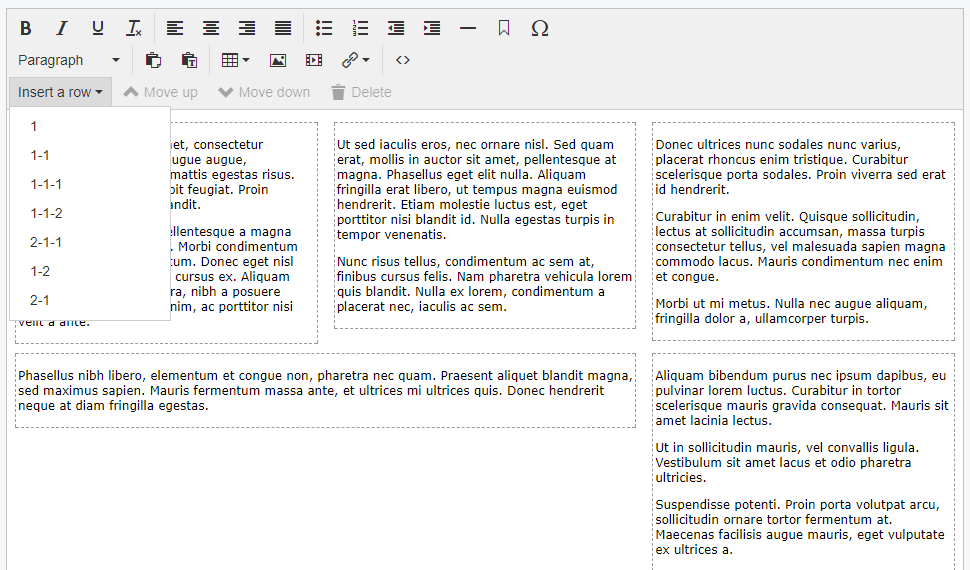

# SilverStripe ContentGrid Module

Adds TinyMCE buttons for creating content structured in grids/columns.  You create your own grid markup and classes.  Grid rows aren't nestable (yet) and assume assume all the content in the field will be stored in grid rows (you can't have content that isn't in one) so make sure to provide a "100% width" option.

**This module is still work in progress**




## Maintainer Contact

* Nathan Cox <me@nathan.net.nz>

## Requirements

* silverstripe/cms >=4.0

## Installation

Composer coming some day.


You will have to make your own grid CSS in your site's theme, this module doesn't provide one. The module inserts the following markup:

```html
<div class="content-row {your-row-class}">
  <div class="content-cell first"></div>
  <div class="content-cell"></div>
  ...
  <div class="content-cell last"></div>
</div>
```

So basically a wrapper div with a div in it for each column.  {your-row-class} is a class specific to each row layout, such as "two-column" for two equal width columns or "with-sidebar" for a content column and a sidebar column.  Whatever your needs and grid system require.

In future these class names should be configurable but for now it always uses `.content-row` and `.grid-row`.

Make sure your grid styles are accessible in editor.css so they work in TinyMCE.

To set up the row dropdown options set the row_types property in your yml config:

```yml
NathanCox\ContentGrid\ContentGrid:
  row_types:
    full-width:               # "twelve" is the name of the {your-row-class} added to the row's element.
      cells: 1                # The number of cells on this row.  In this case a single full-width column.
      text: 1                 # The label the user will see in the dropdown.
    two-columns:
      cells: 2
      text: 1-1
    with-sidebar:
      cells: 2
      text: 2-1
      cell_classes:           # Specify classes for each cell/column in order.
        - content
        - sidebar
    three-columns:
      cells: 3
      text: 1-1-1
      cell_classes:         
        - left                # First column
        -                     # No class for the second column
        - right               # Third column
```

Additional configuration options and their defaults:

```yml
NathanCox\ContentGrid\ContentGrid:
  first_class: "first"          # Set the class to be added to the first cell of every row.  Defaults to "first".
  last_class: "first"           # Set the class to be added to the last cell of every row.  Defaults to "last".
  insert_at_end: false          # Set this to true to always insert new rows at the end fo the page instead of after the current row.
  enabled: true                 # Enable ContentGrid for all HTMLEditorFields.  See below.
```

If `enabled` is set to `true` then this module will apply to all HTMLEditorFields.  Individual fields can be excluded be excluded by using `$field->setAttribute('data-content-grid', 'false')`.

If `enabled` is `false` then grids can be enabled for individual HTMLEditorFields by using `$field->setAttribute('data-content-grid', 'false')`.


## Usage

* Only content inside grid cells is editable.  That means at least one grid row has to be inserted before any content can be put on the page.
* Insert a row by picking an option from the *Insert a row* dropdown.  The new row will either be added at the bottom of the content or immediately after the currently selected row, depending on configuration.
* Use the *Move up* and *Move down* buttons to move the currently selected row up or down the page.
* Use the *Delete* button to delete the current row and all it's content.
* Once you've inserted a row you can't change the number or layout of it's columns.  You'll have to insert a new row and copy the content in to that instead.


##Known Issues

[Issue Tracker](https://github.com/nathancox/silverstripe-contentgrid/issues)
